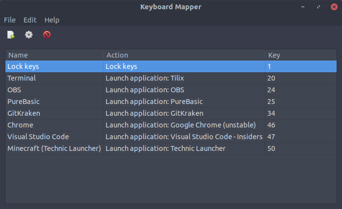
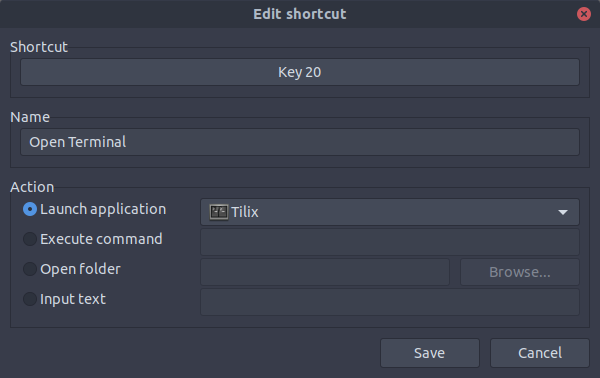
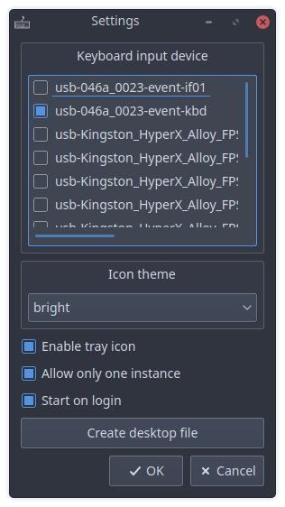

# Keyboard Mapper

A tool for Linux desktops to map keys of dedicated keyboards to specific actions.

[RSBasic](https://www.rsbasic.de) developed a similar application for Windows which got me to the idea of developing something like that for Linux.

## How does it look like?

Main window:



Edit shortcut:



Settings:



## Requirements

* Python 3.6+
* Python modules: See [requirements.txt](requirements.txt) (`pip3 install -r requirements.txt`)

## Installation

* Download the [latest release](https://github.com/Programie/KeyboardMapper/releases/latest)
* Install Python modules using pip: `pip3 install -r requirements.txt`

## Initial configuration

In order to let the X server ignore the input from the keyboard used dedicated for your actions, you have to configure that in your X server configuration:

```
Section "InputClass"
	Identifier      "some unique identifier choosen by you"
	MatchIsKeyboard "on"
	MatchProduct    "The product name of the keyboard (see "xinput list")"
	Option          "Ignore" "true"
EndSection
```

Also make sure, your user has the permission to access the device files (located in `/dev/input`).

After that, you can start the application and select the input devices to use in the settings.

## Usage

Add your first entry by clicking the "Add shortcut" button in the toolbar or selecting it from the application menu.

The following actions are available for each shortcut:

* Launch application: Select one of your installed applications to launch
* Execute command: Execute the specified command (including all arguments which should be passed to it)
* Open folder: Select any folder you would like to open in your default file explorer
* Input text: Send any text to the currently active window (uses the clipboard and sends Ctrl+V to the currently active window)
* Input key sequence: Send any sequence of key combinations to the currently active window (e.g. "Control_L+N Control_L+W" would send Ctrl+N and Ctrl+W)
* Lock keys: Toggle locking of all other actions (only respond to shortcuts with the "Lock keys" action)

## Known issues

### Application theme is different from other applications

When installing PyQt5 using pip, it's possible that the application does not use the native desktop theme. In that case, simply install PyQt5 using your package manager.

In case of Debian based Linux distributions (e.g. Ubuntu, Mint, etc.) install PyQt5 using the following command:

```
sudo apt-get install python3-pyqt5
```

After that you should remove PyQt5 which has been installed by pip using `pip3 uninstall PyQt5`. Otherwise, the application continues to use PyQt5 installed with pip.